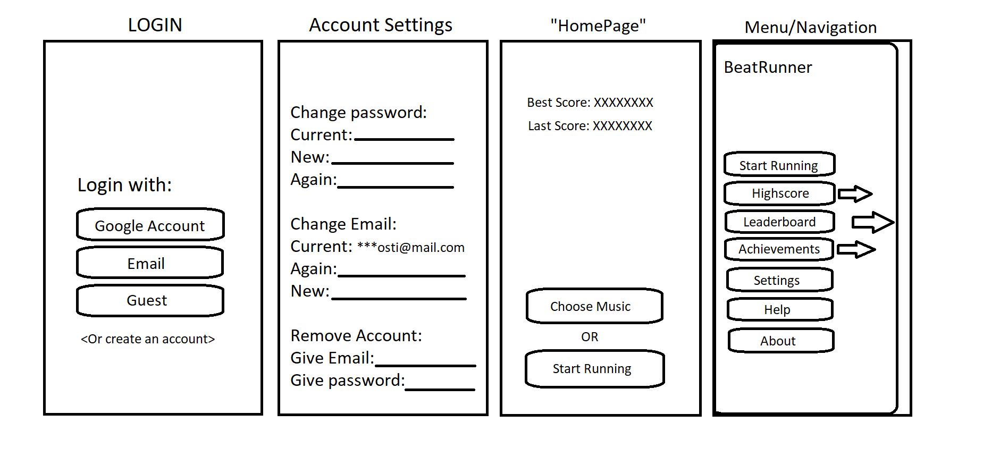

# BeatRunner

BeatRunner (Working title) is an app, that challenges users to stay in sync with their running pace to the beat of music.

The program measures the runner's step rhythm and compares it to the tempo of chosen music. The app comes with pre-installed songs that users can start running to. Staying on beat with the music is rewarded with high scores, which can be compared on leaderboards against others. Initially, the focus of this project is on an Android implementation, but an iPhone version will also be considered.

## Technologies

Preliminary technologies planned for the project:

- Expo for the mobile UI and communication with phone sensors
- Firebase for user account management, storing high scores etc.

## Installation & Setup

#### 1. Prerequisites:

- Node.js installed
- Expo CLI installed (npm install -g expo-cli)
- APK installed on Android device (you can find it [here](https://expo.dev/accounts/beatrunner/projects/beatrunner/builds/2e51205a-cefe-403a-bc9d-d88b587ab30c)) 

#### 2. Clone the repository:

`git clone https://github.com/your-repo/beatrunner.git`
`cd beatrunner`

#### 3. Run the app:

`expo start`

## User Interface
### User Interface Diagram

## Usage

1. Sign up / Log in inside the app
2. Select a level
3. Start running
4. Earn points based on timing and compare scores with others

---

The program is an assignment for the course "Ohjelmistoprojekti 2" (Software Project 2) at Haaga-Helia University of Applied Sciences.
