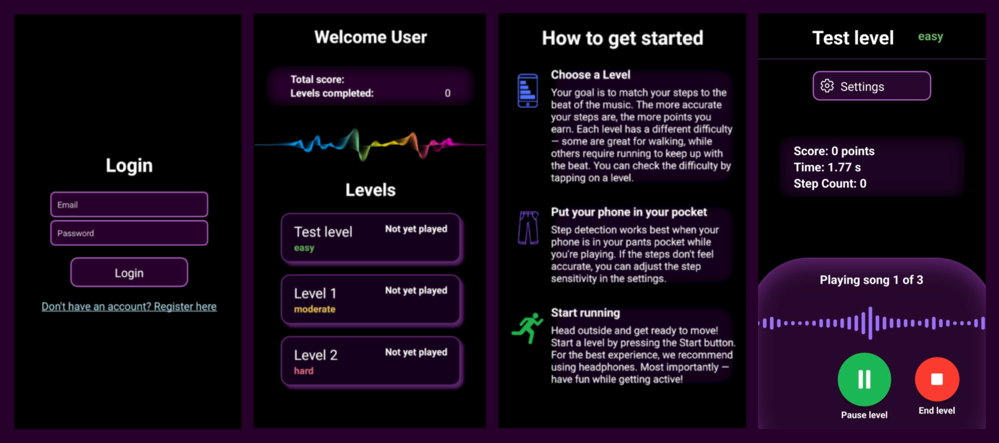

# BeatRunner

BeatRunner (Working title) is a mobile app, that challenges users to stay in sync with the beat of music while running.

The app measures the runner's step rhythm and compares it to the tempo of chosen music. It includes pre-installed songs that are tailored for running sessions. The app features levels, each with different songs and difficulty based on tempo. Staying on beat earns you high scores, which can be compared on leaderboards against others. The project currently focuses on an Android implementation.

## Technologies

- Expo for the mobile UI and communication with phone sensors
- Firebase and Firestore for user account management, storing high scores etc.

## Installation & Setup

#### 1. Prerequisites:

- Node.js installed
- Expo CLI installed (npm install -g expo-cli)
- Node modules installed (npm install)
- APK installed on Android device (you can find it [here](https://expo.dev/accounts/beatrunner/projects/beatrunner/builds/d357db4d-85d1-49f3-bbe0-563cf0209398)) 

#### 2. Clone the repository:

`git clone https://github.com/Ohjelmistoprojekti-2-BeatRunner/BeatRunner.git`
`cd beatrunner`

#### 3. Run the app:

- Start development server
`npx expo start`

- Scan QR code from console to open the project in a development build. 

## User Interface

## Usage

1. Sign up or log in
2. Select a level
3. Start your run
4. Earn points by staying on beat
5. Compare your score against others on the leaderboard
6. Have fun!

---

The program is an assignment for the course "Ohjelmistoprojekti 2" (Software Project 2) at Haaga-Helia University of Applied Sciences.
